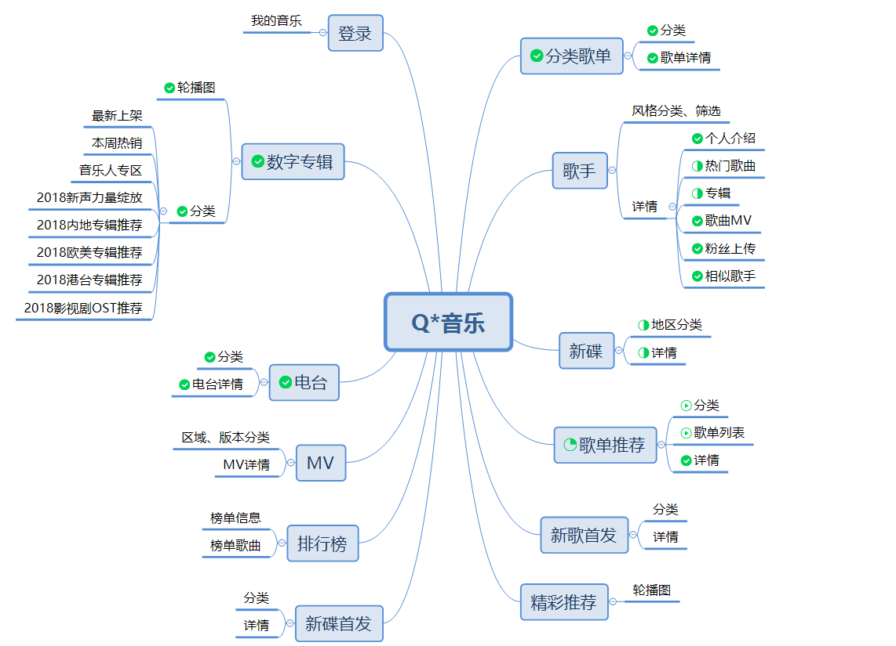

# QQMusicAPI

!> QQ音乐API koa2 版本, 通过Web网页版请求QQ音乐接口数据, 有问题请提 [issue](https://github.com/Rain120/qq-music-api/issues)

!> 当前代码仅共学习，不可做商业用途

### API结构图



### 环境要求

!> 因为本项目采用的是`koa2`, 所以请确保你的`node`版本是7.6.0+

```
node -v
```
### 安装

```
git@github.com:Rain120/qq-music-api.git
npm install
```

### 项目启动
```
// npm i -g nodemon
npm run start

// or don't install nodemon
node app.js
```
项目监听端口是`3200`

### 功能特性

1. 获取QQ音乐产品的下载地址

2. 获取歌单分类

3. 获取歌单列表

4. 获取歌单详情

5. 获取MV标签

6. 获取MV播放信息

7. 获取歌手MV

8. 获取相似歌手

9. 获取歌手信息

10. 获取歌手被关注数量信息

11. 获取电台列表

12. 获取专辑

13. 获取数字专辑

14. 获取歌曲歌词

15. 获取MV

16. 获取新碟信息

17. 获取歌手专辑

18. 获取歌曲VKey

19. 获取搜索热词

20. 获取关键字搜索提示

21. 获取搜索结果

22. 获取首页推荐

23. 获取排行榜单列表

24. 获取排行榜单详情

25. 获取评论信息(cmd代表的意思没太弄明白)

26. 获取票务信息

### 使用文档

使用`apis`详见[文档](https://rain120.github.io/qq-music-api/#/)

### 关于项目

**灵感来自**

[Binaryify/NeteaseCloudMusicApi](https://github.com/Binaryify/NeteaseCloudMusicApi)

[Vue2.0开发企业级移动端音乐Web App](https://coding.imooc.com/class/107.html)

**参考内容**

[Koa 2](https://koa.bootcss.com/)

[Axios](https://github.com/axios/axios)

[阮一峰老师 - HTTP Referer 教程](http://www.ruanyifeng.com/blog/2019/06/http-referer.html)

### 项目不足

1. 因为本人没写过`unit test`, 所以本项目尚未添加`unit test`, 等有时间再添加;

2. 登录获取个人信息等接口都没做

### 关于本人

!> Rain120: 前端菜鸟, 入职前端1年, 公司的技术栈是`React` + `Typescript` + `mobx-state-tree`, 因为公司官网由我重构过, 我使用的`Vue.js`重构的。目前正在脱坑, 求大佬内推呀